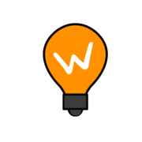
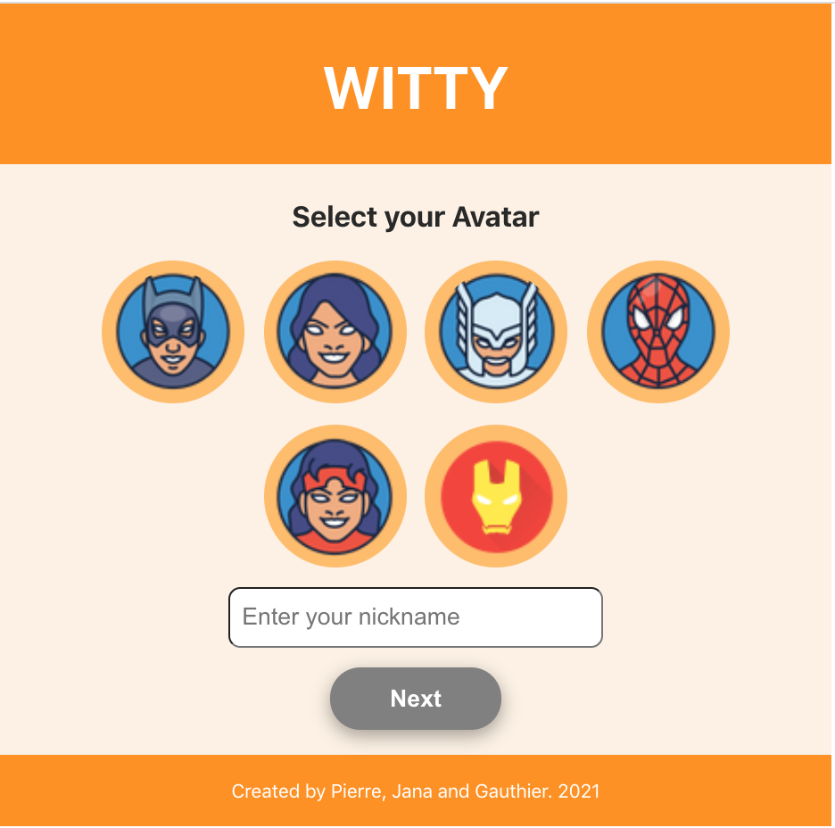

  

 
 
                            

 

<h1>Witty</h1>

 
 
The project is a single page app named Witty .
 Witty allows you to learn and expand your knowledge depending on the topic you choose.It is your new favorite pass time while waiting on your next meetings.

<a href="https://witty-quiz.netlify.app//">View Project</a>

 

<h2>About the project</h2>

 

This project lasted 5 weeks and was part of a 5 months bootcamp at Wild Code School and made by the following developers. 

  - <a href="https://github.com/vmalep">Pierre VAN MALE</a>
  - <a href="https://github.com/JanaKudlickova">Jana KUDLICKOVA</a>
  - <a href="https://github.com/gc2211">Gauthier CHATEL</a>

 

                            

 

<h2>Tools used </h2>
We used Jira as our main tool to assist in the project management. For day to day communication we used Slack and Google Meet.

 

<h2>How the app works</h2>
 
 - 1 Select your avatar
 - 2 Choose your username
 - 3 Countdown on/off
 - 4 Pick the difficulty and category in which you want test your knowledge in
 - 5 Click next and ... you are good to go !
 - 6 Exit the game anytime by simply clicking the Exit button 
 
 

<h2>About the code</h2>
The main frameworks and technologies used to build our Project are the following:

React (with Hooks)
 
<h2>API</h2>
<a href="https://opentdb.com/api_config.php">OPEN TRIVIA DATABASE</a>

 

<h2>License</h2>
See the <a href="https://github.com/vmalep/witty/blob/master/LICENSE.md">LICENSE</a> for license rights and limitations (MIT)
